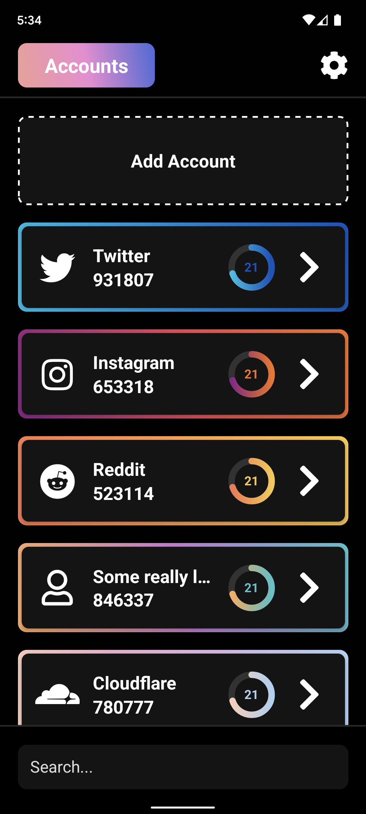

# 2FA Notifier

## Disclaimer

This project is currently a work in progress.

### What is 2FA Notifier?

2FA Notifier is a Chrome Extension and Android app. The extension will allow you to enter your FCM token (shown on the app). On the mobile app, you'll be able to scan QR codes or enter keys in order to generate TOTP and HOTP codes used for 2FA. When you add an account to the mobile app, the hash of the URL of the website the account is for will be saved. Whenever you click on the extension, the URL of the website you're currently on will be sent to the mobile app as a hash, which will automatically grab the corresponding 2FA code, and display it as a notification (optionally, it can provide quick access to it without showing the actual code as other apps can read notifications, and for security). In short, this will save you having to open Authy/Google Authenticator, and search for the account you need a 2FA code for.
